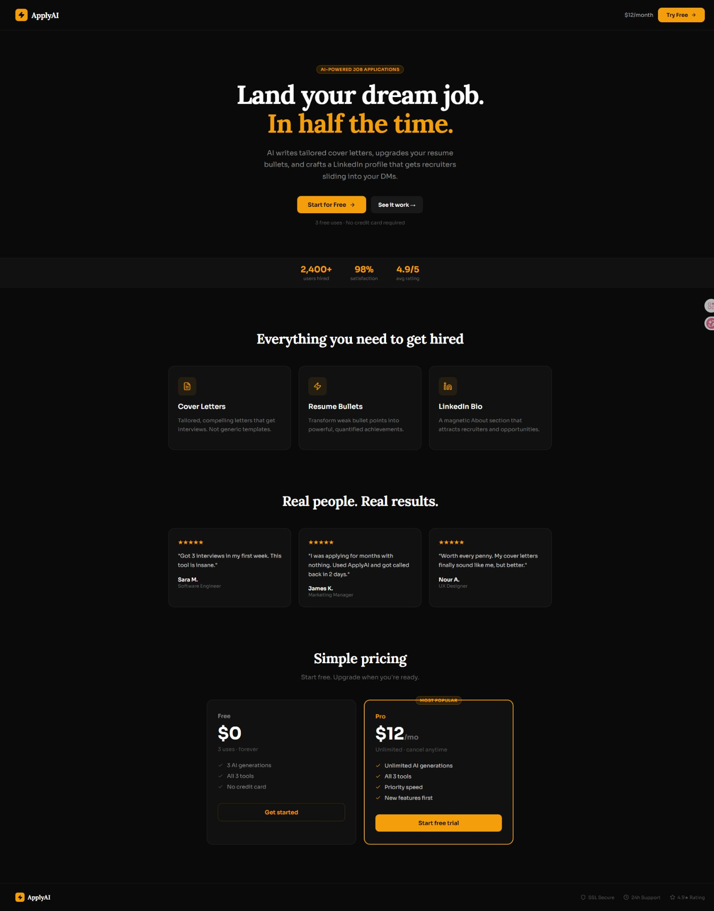
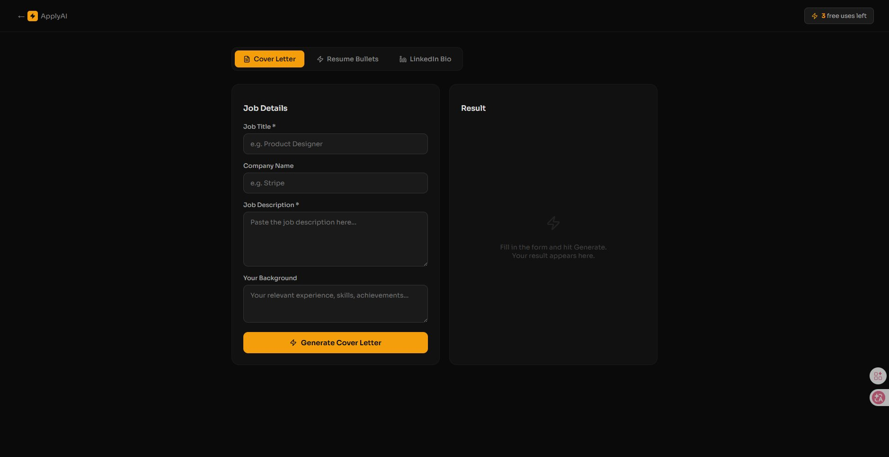

<div align="center">

# ⚡ APPLYAI

[](https://git.io/typing-svg)

<br/>

[](https://react.dev)
[](https://anthropic.com)
[](https://vercel.com)
[](https://stripe.com)
[](LICENSE)

<br/>

> **An AI-powered job application suite that writes tailored cover letters,**
> **upgrades your resume bullets, and crafts a LinkedIn bio — in seconds.**

<br/>

</div>

---

## 📸 Screenshots

<div align="center">

### 🏠 Landing Page — Hero, Features, Pricing & Social Proof


<br/><br/>

### ⚡ App — Cover Letter Generator


</div>

---

## ✨ What it does

<table>
<tr>
<td align="center" width="33%">
<br/>
<br/><br/>
Paste any job description and your background. Get a compelling, tailored 3-paragraph cover letter that sounds like a real human wrote it — not a template.
<br/><br/>
</td>
<td align="center" width="33%">
<br/>
<br/><br/>
Paste your weak, vague bullet point. Get 3 powerful rewrites with strong action verbs and quantified impact that hiring managers actually care about.
<br/><br/>
</td>
<td align="center" width="33%">
<br/>
<br/><br/>
Enter your role and skills. Get a magnetic LinkedIn About section written in first person that attracts recruiters and opportunities.
<br/><br/>
</td>
</tr>
</table>

**The business model:**

| Plan | Price | Limit |
|------|-------|-------|
| Free | $0 | 3 AI generations |
| Pro | $12/month | Unlimited everything |

> 84 Pro customers = **$1,008/month** — with ~$0 hosting cost and ~$8/month in API fees.

---

## ⚡ Quick Start

> Get running in under 5 minutes.

**Prerequisites:** Node.js v18+

### 1. Clone the repo

```bash
git clone https://github.com/JINZO-AI/applyai.git
cd applyai
```

### 2. Install dependencies

```bash
npm install
```

### 3. Add your API key

Create a `.env` file in the root:

```env
REACT_APP_ANTHROPIC_KEY=sk-ant-your-key-here
```

Get your key at: [console.anthropic.com](https://console.anthropic.com)

### 4. Run it

```bash
npm start
```

✅ App running at `http://localhost:3000`

---

## 🚀 Deploy to Vercel (free)

```bash
npm run build
npx vercel --prod
```

Or connect your GitHub repo directly at [vercel.com](https://vercel.com) — auto-deploys on every push.

---

## 📁 Project Structure

```
applyai/
│
├── src/
│   └── App.js          # Full application (landing + tool pages)
├── public/
├── docs/
│   ├── landing.png     # Screenshot — landing page
│   └── tool.png        # Screenshot — tool page
├── .env                # Your API key (never commit this)
├── package.json
└── README.md
```

---

## 💰 Monetization Setup

**Stripe** — Create a $12/month recurring product and paste the payment link into the upgrade button.

**Supabase** — Free database to track user email + usage count for the free tier limit.

**Vercel Serverless** — Move the API call to `/api/generate.js` so your Anthropic key is never exposed in the browser.

---

## 🗺️ Roadmap

- [x] Cover letter generator
- [x] Resume bullet upgrader  
- [x] LinkedIn bio writer
- [x] Freemium model (3 free → $12/month)
- [ ] Stripe payment integration
- [ ] Supabase usage tracking
- [ ] Email capture & drip campaign
- [ ] Referral program

---

<div align="center">

Built with ⚡ by [JINZO-AI](https://github.com/JINZO-AI)

</div>
